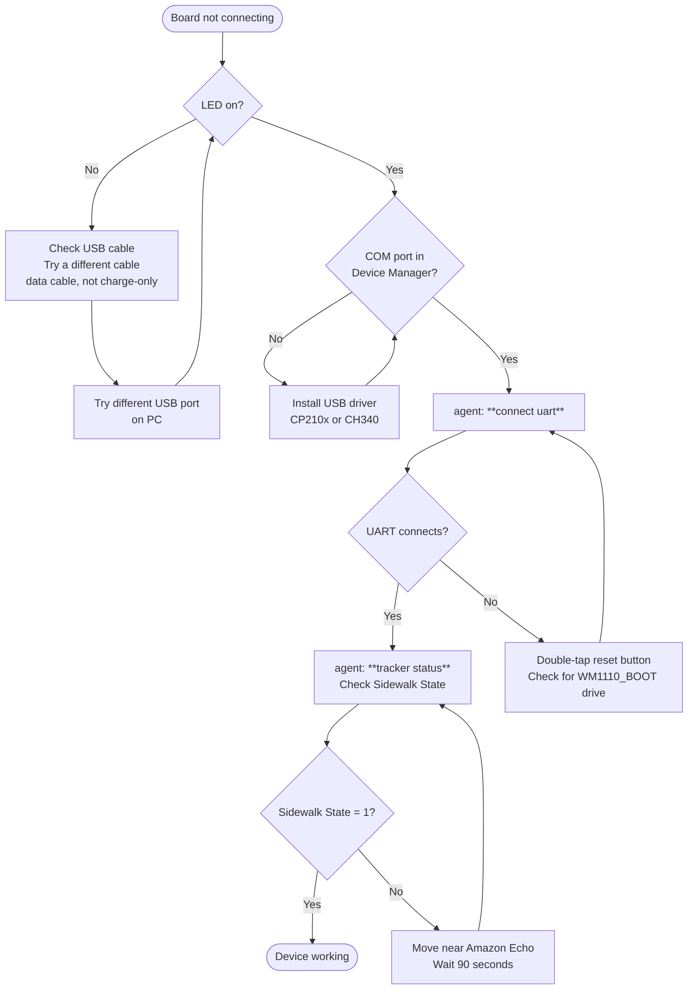

# WM1110 Asset Tracker — Hardware Quick Reference
## Generated from: README.md, PAYLOADS.md, DTS, CBK docs — NCS v3.2.1 — May 2026
## Format: PRD Part 5 § 5.3

---

## What This Device Does

The Wio Tracker 1110 is a small battery-powered asset tracking device built by Seeed Studio.
It connects to the internet using Amazon's Sidewalk network — the same wireless network your
Amazon Echo uses — and automatically sends its GPS location, temperature, humidity, and
movement status to the cloud every minute. You can see where it is and how it is doing from
a web dashboard powered by AWS IoT Core.

---

## What "Working Correctly" Looks Like

- Blue LED on top of the board blinks once per second (slow steady blink)
- USB terminal shows prompt: `asset-tracker >`
- Running `tracker status` shows: **Sidewalk State: 1**, **Stack started: yes**
- Running `tracker status` shows a battery percentage and temperature reading
- AWS IoT dashboard receives sensor updates approximately every 60 seconds
- Log shows `[AT] Outgoing msg: STACK TX OK` at least once per minute

---

## What "Not Working" Looks Like

| What you see | What it means |
|---|---|
| No LED at all | No power — check USB cable and battery |
| LED blinks twice per second (fast) | Device is actively sending data right now — normal, brief |
| LED flashes rapidly (every 0.1 s) for ~3 seconds | Last message failed to send — retrying automatically |
| `Link Type: Unknown` in `tracker status` | Normal — device is in dual BLE+LoRa mode. Not a fault. |
| `Sidewalk State: 0` | Device not yet connected to Sidewalk network |
| `Awaiting device registration on the Sidewalk network...` in logs | First boot or after factory reset — device is registering |
| `Failed to start location scan: -1` in logs | Location SDK state issue — power-cycle the device |
| `SDK send FAIL (err=-2 SID_ERROR_TIMEOUT)` | LoRa gateway (Echo) not reachable — check proximity |
| AWS shows Echo home address, not GPS coordinates | Expected with BLE gateway location — see notes.md Issue 3 |
| LED frozen during `location send 4` | Normal — GNSS scan takes 60–120 s; LED doesn't go busy from shell |
| No `WM1110_BOOT` USB drive on double-tap reset | Bootloader may be corrupted — see Firmware Flashing section |
| USB terminal shows nothing after connecting | Try a data USB cable (not charge-only); try another USB port |

## Not Connecting — Quick Troubleshoot



---

## LED Reference Table

| LED  | Board location | Colour | Pattern              | Meaning                                     |
|------|----------------|--------|----------------------|---------------------------------------------|
| LED0 | Top of board   | Blue   | 1 s blink (slow)     | Idle — connected and healthy                |
| LED0 | Top of board   | Blue   | 0.5 s blink (fast)   | Busy — actively sending data or scanning    |
| LED0 | Top of board   | Blue   | 0.1 s rapid, ~3 s    | TX fault — last message failed, will retry  |
| LED0 | Top of board   | Blue   | OFF                  | No power, or bootloader mode (WM1110_BOOT)  |

**Hardware note (from DTS):** LED0 is on GPIO P0.06, active-low (GPIO_ACTIVE_LOW).
A GPIO LOW turns the LED ON.

Image: images/led_locations.png

---

## Button Reference Table

| Button | Board location | Short press (<2 s) | Long press (≥2 s) |
|--------|----------------|-------------------------------------------|--------------------------------------------|
| USER   | Top of board   | Trigger manual scan + uplink (5 s one-shot; same as periodic cycle) | Toggle radio: BLE-only ↔ LoRa-only ↔ dual |

**PoC verified:** Long-press threshold = 2000 ms (`CONFIG_LONG_PRESS_PER_MS`). Short press only when no NOTIFY in flight.

**Notes:**
- Short press only works when no send is already in progress
  (if one is, UART logs: `[AT] Manual uplink cycle: ignored (NOTIFY still in progress)`)
- Long press is ignored on BLE-only or LoRa-only firmware builds
- Long press threshold: 2000 ms (configurable via `CONFIG_LONG_PRESS_PER_MS`)

**Hardware note (from DTS):** Button0 is on GPIO P1.02, pull-up, active-low.

Image: images/button_locations.png

---

## USB Connection

**Which port:** USB-C port on the Wio Tracker 1110 board

**Cable:** Must be a **data cable** (not a charge-only cable). The device uses USB CDC ACM
(virtual serial port). Charge-only cables have no data lines and will not create a COM port.

**Settings:**
- Baudrate: **115200**
- Data bits: 8, Parity: None, Stop bits: 1 (8N1)
- Flow control: None

**On Windows:** Device appears as a COM port. Open Device Manager → Ports (COM & LPT).
Look for "USB Serial Device" or "Asset Tracker" (USB VID: 0x2886, PID: 0x0052,
Manufacturer: "Seeed Technology").

**On Linux/Mac:** Device appears as `/dev/ttyACM0` or `/dev/tty.usbmodem*`.

**Common mistake:** Charge-only USB cables — device will power on but no COM port appears.
Try a different cable or different USB port.

---

## Baud Rate — Can It Be Changed?

The WM1110 Asset Tracker firmware uses a **fixed UART baud rate of 115200 8N1** for the USB CDC console. You do **not** change this in firmware, `prj.conf`, or on the device for normal use.

**What to do:** Set your terminal program (PuTTY, Tera Term, nRF Connect Serial Terminal, or this agent's `connect uart`) to:

- **Baud:** 115200
- **Data bits:** 8
- **Parity:** None
- **Stop bits:** 1
- **Flow control:** None

If log output looks garbled (random characters), your terminal baud is wrong — fix the **terminal setting**, not the device firmware.

The Grove UART header (UART1) also uses 115200 in this project — same rule applies.

---

## Hardware Specifications (from board DTS and product docs)

| Component | Chip / Detail |
|---|---|
| Main SoC | Nordic nRF52840 (ARM Cortex-M4F, 1 MB flash, 256 KB RAM) |
| Sub-GHz radio | Semtech LR1110 (LoRa + WiFi scanner + GNSS receiver) |
| BLE | nRF52840 integrated BLE 5.x (Sidewalk BLE gateway) |
| Temperature/Humidity | Sensirion SHT41 (I2C 0x44, ±0.2°C, ±1.8% RH) |
| Accelerometer | ST LIS3DH (I2C 0x19, 3-axis, used for motion detection) |
| External flash | P25Q32SH QSPI NOR flash, 4 MB |
| BLE TX power | +6 dBm max (nRF52840 board spec) |
| LoRa TX power | +22 dBm max (LR1110 HP PA) |
| LoRa antenna gain | −1 dBi (onboard PCB antenna) |
| GNSS constellations | GPS + BeiDou (via LR1110) |
| USB | USB CDC ACM via nRF52840 USB (VID: 0x2886, PID: 0x0052) |
| App firmware version | v2.0.0 (NCS v3.2.1) |
| LR1110 modem firmware | ≥ 0x0401 required for Sidewalk |

---

## Sensor Data Sent to AWS IoT Core

Every uplink cycle sends a 5-byte telemetry payload:

| Field | Byte | Type | Range | Example |
|---|---|---|---|---|
| Message type | 0 (bits 7–6) | uint8 | 0x01 = SENSOR_TELEMETRY | 0x40 |
| Battery level | 1 | uint8 | 0–100 % | 0x5F = 95% |
| Temperature | 2 | int8 | −128 to +127 °C (signed) | 0x1E = 30°C |
| Humidity | 3 | uint8 | 0–100 % | 0x34 = 52% |
| Motion + Peak accel | 4 | uint8 | bit7=motion, bits6–0=peak accel | 0x00 = no motion |

**Note:** Battery reading is currently hardcoded at 95% pending hardware ADC implementation.
Temperature and humidity are live from the SHT41 sensor.
Motion is derived from LIS3DH accelerometer: `|accel| − g > 2 m/s²` sets the motion bit.

---

## Grove Connector Reference (from DTS)

| Connector | Type | Pins (DTS) | Use |
|---|---|---|---|
| grove_digital0 | Digital GPIO | P0.13, P0.14 | General GPIO |
| grove_digital1 | Digital GPIO | P0.15, P0.16 | General GPIO |
| grove_digital2 | Digital GPIO | P0.30, P0.31 | General GPIO |
| grove_digital_analog | Digital/Analog | P0.28, P0.29 | ADC-capable GPIO |
| grove_digital_uart | UART | P0.24 (TX), P0.25 (RX) | UART1 @ 115200 — alt console |
| grove_digital_i2c | I2C | P0.04 (SDA), P0.05 (SCL) | I2C bus |

**Important:** The Grove UART connector (P0.24/P0.25) is used as the alternate serial
console during LR1110 firmware update (SWTL001 tool). Do not connect other devices to this
port during LR1110 update.

---

## Flash Memory Partition Map (from DTS)

**Detailed map with ELF usage, RAM breakdown, and 0xD0000 provisioning address:** `context/memory_map.md`

| Partition | Address | Size | Contents |
|---|---|---|---|
| boot_mbr | 0x00000000 | 4 KB | Nordic MBR |
| code (app) | 0x00001000 | ~828 KB | Asset Tracker firmware (~661 KB used in current build) |
| mfg_storage | 0x000D0000 | 4 KB | Sidewalk provisioning/mfg data |
| sidewalk_storage | 0x000D1000 | 4 KB | Sidewalk state storage |
| storage (NVS) | 0x000D2000 | 64 KB | Settings NVS (16 × 4 KB sectors) |
| reserved | 0x000E2000 | ~68 KB | Future use |
| hw_unique_key | 0x000F3000 | 4 KB | Hardware unique key |
| bootloader (UF2) | 0x000F4000 | 32 KB | Adafruit UF2 bootloader |
| bootloader_data | 0x000FC000 | 8 KB | Bootloader data |
| bootloader_mbr_params | 0x000FE000 | 4 KB | MBR parameters |
| bootloader_settings | 0x000FF000 | 4 KB | Bootloader settings |

**Warning:** `west flash --erase` or `nrfjprog --chiperase` erases ALL partitions including
the UF2 bootloader at 0xF4000. Use `west flash` (no --erase) for routine application updates.

---

## Firmware Flashing Methods

### Method 1 — UF2 Drag and Drop (easiest, no tools needed)
1. Double-tap the **RESET** button on the board
2. USB drive named **`WM1110_BOOT`** should appear on your PC
3. Copy `AssetTrackerDeviceApp.uf2` onto the drive
4. Drive disappears and board reboots automatically

**UF2 file location (after build):**
`wm1110-asset-tracker\build\wm1110-asset-tracker\wm1110-asset-tracker\zephyr\AssetTrackerDeviceApp.uf2`

### Method 2 — J-Link / nrfjprog (requires SWD debugger)
```
nrfjprog --program build/wm1110-asset-tracker/merged.hex --verify -f NRF52
nrfjprog --reset -f NRF52
```
Do NOT add `--chiperase` — this destroys the UF2 bootloader.

### Method 3 — Enter Bootloader via Shell (no physical button needed)
Connect to UART shell and type:
```
tracker enter_bootloader
```
Device resets into UF2 bootloader mode. `WM1110_BOOT` drive appears.

---

## Bootloader Recovery (when WM1110_BOOT no longer appears)

If the UF2 bootloader has been overwritten (e.g. after LR1110 firmware update using
full chip erase), restore it:

**Requires:** J-Link SWD debugger + `wio_tracker_1110_bootloader-0.7.0_nosd.hex`

```
nrfjprog --program wio_tracker_1110_bootloader-0.7.0_nosd.hex --chiperase --verify -f NRF52
nrfjprog --reset -f NRF52
```

After recovery: double-tap reset → `WM1110_BOOT` should appear.
Then re-flash the application firmware (UF2 or nrfjprog).

**Note:** Bootloader recovery erases nRF52840 flash only. LR1110 modem firmware (separate
chip) is NOT affected by nRF chip erase.

See: `CBK/NEW_BOOT/QUICK_USER_GUIDE_FLASH_AND_RECOVERY.md` for full procedure.

---

## LR1110 Sub-GHz Radio Notes

- **Minimum firmware version required for Sidewalk:** 0x0401
- LR1110 firmware version is printed at every boot: `LR11XX FW Version = 0x[XX]`
- If `Radio init failed` appears at boot, LR1110 modem may be on older firmware
- LR1110 firmware update procedure is separate from application firmware — uses SWTL001 tool
  with J-Link over SWD and Grove UART connector (P0.25/P0.24) for logs
- See: `CBK/LR1110-UPDATE/CBK LR1110-Update-Readme.md` (internal/engineering doc)

---

## What I Can Help You With

- Explain any UART log message or error code from the terminal
- Check device connection status and Sidewalk network state
- Guide through triggering a location scan or manual data send
- Switch between BLE and LoRa radio modes
- Walk through factory reset step by step
- Enter bootloader mode for firmware update
- Explain what temperature, humidity, battery, and motion readings mean
- Diagnose why location coordinates are wrong or not updating on AWS
- Explain the sensor payload format (PAYLOADS.md)
- Guide through UF2 drag-and-drop firmware update

---

## What Requires an Engineer

- Changing firmware source code (`.c` / `.h` / `prj.conf`)
- LR1110 modem firmware update (SWTL001 tool, J-Link, internal procedure)
- Bootloader recovery (requires J-Link SWD hardware)
- Hardware damage (damaged antenna, broken GPIO, board fault)
- AWS IoT Core provisioning, rules, and Lambda configuration
- Sidewalk network device registration issues beyond factory reset
- Adding new sensor types or Grove peripherals
- GNSS constellation or scan mode changes (requires rebuild)
- Any change to flash partitions (requires rebuild + full reflash)


# Hardware Quick Reference

[TODO: run west build then re-run generate_pack]
